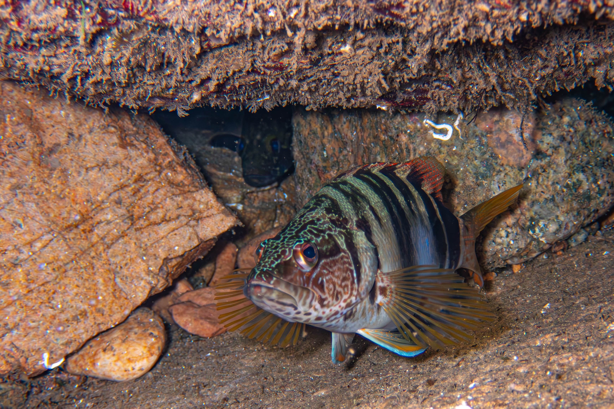

<h3 align="center">Postdoctoral Researcher in Marine Ecology | Global Change Ecology</h3>

  

I am a marine ecologist investigating the complex dynamics of our changing oceans. My research primarily explores macroecology and the impacts of climate change—such as chronic ocean warming and marine heatwaves—on fish biomass, high-velocity range shifts, and depth redistributions. Additionally, I work extensively in invasion ecology, tracking non-indigenous species and tropicalization patterns to better understand native habitat affinities and post-invasion ecological shifts.

### 🔬 What I Do
- 🌊 **Macroecology & Climate Change:** Modeling species distributions and analyzing how cold-water species adapt to thermal stress and changing habitats.
- 🐠 **Invasion Ecology:** Investigating the establishment, dynamics, and traits of invasive marine species in new environments.
- 📊 **Statistical Modeling:** Leveraging advanced R scripting to wrangle, analyze, and visualize long-term ecological datasets.
- 🗣️ **Science Communication:** Translating complex ecological data and peer-reviewed findings into accessible insights for the public and media.

🌐 **Website & Portfolio:** [sites.google.com/view/schaikin/home](https://sites.google.com/view/schaikin/home)

### 📚 Featured Research
* **[Long-term warming reduces fish biomass, but heatwaves shift it](https://doi.org/10.1038/s41559-026-03013-5)**
    *Chaikin, S., González-Trujillo, J. D., & Araújo, M. B. (2026).* Nature Ecology & Evolution.
* **[Marine fishes experiencing high-velocity range shifts may not be climate change winners](https://doi.org/10.1038/s41559-024-02350-7)**
    *Chaikin, S., Riva, F., Marshall, K. E., Lessard, J. P., & Belmaker, J. (2024).* Nature Ecology & Evolution.
* **[Cold-water species deepen to escape warm water temperatures](https://doi.org/10.1111/geb.13414)**
    *Chaikin, S., Dubiner, S., & Belmaker, J. (2021).* Global Ecology and Biogeography.

  <!-- Replace 'your-fish-image.jpg' with your actual file name -->
  

